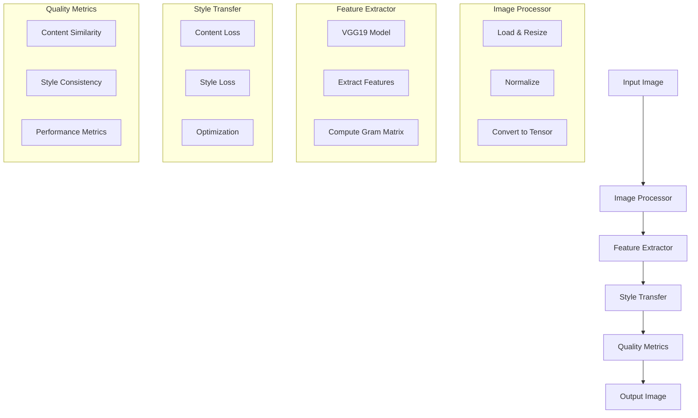

# AI Pipeline Overview

## Current Implementation



## What We Have Built

### 1. Image Processor (Input Handler)
- **Input:** Regular image file (jpg, png)
- **Output:** Normalized tensor ready for AI processing
- **Location:** `ai_service/src/utils/image_processing.py`
- **Purpose:** Prepares images for AI processing

### 2. Feature Extractor (Image Analysis)
- **Input:** Processed image tensor
- **Output:** Image features from different VGG19 layers
- **Location:** `ai_service/src/models/feature_extractor.py`
- **Purpose:** Analyzes image characteristics

### 3. Style Transfer (Core AI)
- **Input:** Content image and style image features
- **Output:** Transformed image combining content and style
- **Location:** `ai_service/src/models/style_transfer.py`
- **Purpose:** Combines content and style of images

### 4. Quality Metrics (Result Validation)
- **Input:** Original and transformed images
- **Output:** Quality scores and performance metrics
- **Location:** `ai_service/src/utils/quality_metrics.py`
- **Purpose:** Measures transformation quality

### 5. Web Service (NEW!)
- **Location:** `ai_service/src/api/`
- **Main Components:**
  - FastAPI Application (`app.py`)
  - Transformation Service (`services/transform_service.py`)

#### Available Endpoints:
1. **GET /** - Service information
2. **GET /health** - Health check
3. **POST /transform** - Transform images
   - Upload content image
   - Upload style image
   - Get transformed result
4. **GET /result/{id}** - Download results

## How to Use the Service

### 1. Start the Service
```bash
python src/api/app.py
```

### 2. Transform an Image
1. Send POST request to `/transform`
2. Upload two images:
   - Content image (your photo)
   - Style image (historical postcard)
3. Get result ID
4. Download transformed image from `/result/{id}`

### 3. View Documentation
- Interactive API docs: `http://localhost:8000/docs`
- Alternative docs: `http://localhost:8000/redoc`

## Testing the Service

### 1. Automated Tests
Located in `ai_service/tests/test_api.py`
- Tests all API endpoints
- Verifies transformation pipeline
- Checks error handling
- Tests concurrent requests
- Validates parameter handling

To run automated tests:
```bash
pytest ai_service/tests/test_api.py -v
```

### 2. Manual Testing
Located in `ai_service/tests/manual_test.py`
- Tests with real images
- Provides detailed output
- Saves results and metrics
- Easy to use interface

To run a manual test:
```bash
python manual_test.py path/to/content.jpg path/to/style.jpg path/to/output.jpg
```

Example output:
```
Checking service health...
Service is healthy

Preparing to transform content.jpg with style from style.jpg

Sending transformation request...
Transformation completed in 25.34 seconds

Quality Metrics:
Content Similarity: 0.856
Style Consistency: 0.723

Result saved to output.jpg
Metrics saved to output.json
```

## Next Steps
1. Add period-specific style selection
2. Implement batch processing
3. Add result caching
4. Optimize performance

## Simple Example
```python
# Using Python requests
import requests

# Upload images
files = {
    'content_image': open('your_photo.jpg', 'rb'),
    'style_image': open('postcard.jpg', 'rb')
}

# Transform
response = requests.post('http://localhost:8000/transform', files=files)
result = response.json()

# Download result
result_image = requests.get(f"http://localhost:8000/result/{result['id']}")
with open('transformed.jpg', 'wb') as f:
    f.write(result_image.content)
```
